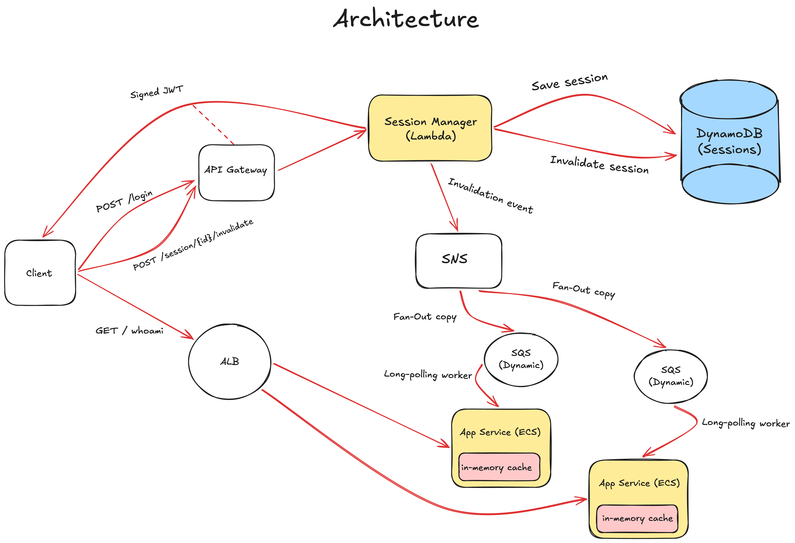

# Decentralized JWT Invalidation

A cloud-native, event-driven architecture for decentralized JWT session invalidation in AWS.



## How It Works

- **Tokens (RS256):** Lambda signs JWTs using a private key. The application service verifies them locally using the public key without querying a database.
- **Invalidation (Fan-Out):** When a session is invalidated, Lambda sends an event to an SNS topic. Each running application instance receives the event through its own SQS queue and saves the invalidated session in memory.
- **Cleanup:** Expired sessions are automatically removed from DynamoDB via TTL and from local memory on a schedule.

---

## Architecture Components

| Component | Technology | Role |
| :--- | :--- | :--- |
| **Session Manager** | AWS Lambda, API Gateway v2, DynamoDB | Handles authentication (`/login`), token issuance (RS256), session persistence, and invalidation event publishing. |
| **Application Service** | Node.js, Express, ECS Fargate, ALB | Serves authenticated endpoints (`/whoami`), performs in-memory JWT verification, and consumes revocation events via SQS. |
| **Event Bus** | AWS SNS Topic, Ephemeral SQS Queues | Fan-out distribution delivering revocation events to all active application replicas in parallel. |
| **Infrastructure** | Terraform, Docker, AWS ECR | Modular Infrastructure as Code provisioning VPC, ALB, ECS, IAM Least Privilege, and Lambda. |

---

## Project Structure

```
├── terraform/               # Infrastructure as Code (VPC, ECS, ALB, Lambda, DynamoDB, SNS)
├── services/
│   ├── session-manager/     # Lambda handler (login, token issuance, revocation)
│   └── application-service/ # Express server on ECS Fargate (in-memory cache & SQS worker)
├── keys/                    # RSA key pair directory (.gitkeep)
├── docs/                    # Architecture diagrams and specifications
└── Makefile                 # Build, deployment, and local run automation
```

---

## Prerequisites

- **AWS CLI** (configured with appropriate credentials / profile)
- **Terraform** >= 1.5.0
- **Docker** & **Node.js** >= 20
- **OpenSSL** (for key generation)

---

## Deployment & Operation

All primary workflows are automated via `Makefile`:

### 1. Generate RSA Keys
Generates a 2048-bit RSA key pair in the `keys/` directory (git-ignored):
```bash
make keys
```

### 2. Full Deployment to AWS
Builds the services, creates the ECR repository, pushes the Docker image, and applies the complete Terraform stack:
```bash
make deploy
```
Upon completion, Terraform will output the endpoints:
- `session_manager_api_url`: API Gateway base URL.
- `application_service_url`: Application Load Balancer URL.

### 3. Local Development (Hybrid Mode)
Runs the `application-service` locally on `http://localhost:3000` while connecting to the deployed AWS SNS topic via an ephemeral SQS queue:
```bash
make run-local
```

### 4. End-to-End Verification Flow
Verify the revocation lifecycle against the deployed stack:

```bash
# Set endpoints from Terraform output
SESSION_API=$(cd terraform && terraform output -raw session_manager_api_url)
APP_URL=$(cd terraform && terraform output -raw application_service_url)

# 1. Login and extract JWT
TOKEN=$(curl -s -X POST "${SESSION_API}/login" \
  -H "Content-Type: application/json" \
  -d '{"username":"admin","password":"password123"}' | jq -r .token)

# 2. Extract sessionId from token (or call /whoami)
SESSION_ID=$(curl -s -H "Authorization: Bearer ${TOKEN}" "${APP_URL}/whoami" | jq -r .sessionId)

# 3. Access protected route (Returns HTTP 200)
curl -i -H "Authorization: Bearer ${TOKEN}" "${APP_URL}/whoami"

# 4. Invalidate session (Fanned out via SNS to all ECS instances)
curl -i -X POST "${SESSION_API}/session/${SESSION_ID}/invalidate"

# 5. Access protected route again (Returns HTTP 401 Unauthorized immediately)
curl -i -H "Authorization: Bearer ${TOKEN}" "${APP_URL}/whoami"
```

### 5. Tear Down
Destroys all provisioned AWS cloud resources:
```bash
make destroy
```

---

## API Reference

### Session Manager (API Gateway)

#### `POST /login`
Authenticates user credentials and issues an RS256-signed JWT.
- **Request:**
  ```json
  {
    "username": "admin",
    "password": "password123"
  }
  ```
- **Response (`200 OK`):**
  ```json
  {
    "token": "eyJhbGciOiJSUzI1NiIsInR5cCI6IkpXVCJ9..."
  }
  ```

#### `POST /session/{sessionId}/invalidate`
Marks the session as invalidated in DynamoDB and publishes an invalidation event to SNS.
- **Response (`200 OK`):**
  ```json
  {
    "message": "Session successfully invalidated",
    "sessionId": "b48c484f-82bb-4c22-b5e2-628b74681121",
    "expiration": 1727521200
  }
  ```

---

### Application Service (ALB / ECS Fargate)

#### `GET /whoami`
Validates the JWT token using the RSA public key and checks the local cache of invalidated sessions.
- **Header:** `Authorization: Bearer <jwt>`
- **Response (`200 OK`):**
  ```json
  {
    "serviceName": "Application Service",
    "sessionId": "b48c484f-82bb-4c22-b5e2-628b74681121",
    "jwtExp": 1727521200
  }
  ```
- **Response (`401 Unauthorized`):**
  ```json
  {
    "error": "Unauthorized",
    "message": "Session has been invalidated"
  }
  ```

#### `GET /health`
ALB target group health check endpoint.
- **Response (`200 OK`):**
  ```json
  {
    "status": "ok"
  }
  ```
